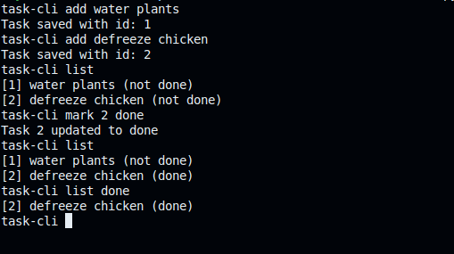

# Task Tracker

Task-tracker is a commandline interface application to help user manage and track their tasks efficiently. It allows users to store, update and monitor tasks using straight forward commands.



## Prerequisites

Before you begin ensure your computer has the following installed:

- Python 3.10 or higher
- an accessible terminal

## Installing Task-Tracker

To install Task-Tracker, follow these steps:

1. Clone this project via git:

   ```shell
   git clone https://github.com/SymonMuchemi/Task-Tracker.git
   ```

## Using Task-Tracker

To use the app:

1. move to the directory created after cloning:

   ```shell
   cd Task-Tracker
   ```

2. Run the console module:

   ```shell
   ./console
   ```

## Features

- [x] Adding tasks
- [x] Storing tasks
- [x] Updating task descriptions
- [x] Marking task as 'done', 'not-done' or 'in-progress'
- [x] Listing all done tasks
- [x] Listing all in-progress tasks
- [ ] Listing all incomplete tasks

## Contributing to Task-Tracker

1. Fork this repository.
2. Create a new branch: `git checkout -b <branch_name>`
3. Make your changes and commit them: `git commit -am '<commit message>'`
4. Push you changes to the original branch: `git push origin master`
5. Create a pull request

Alternatively see the GitHub documentation on [creating a pull request](https://help.github.com/en/github/collaborating-with-issues-and-pull-requests/creating-a-pull-request)

## Contributors

Thanks to the following people who have contributed to this project:

- [@SymonMuchemi](https://www.github.com/symonmuchemi)
